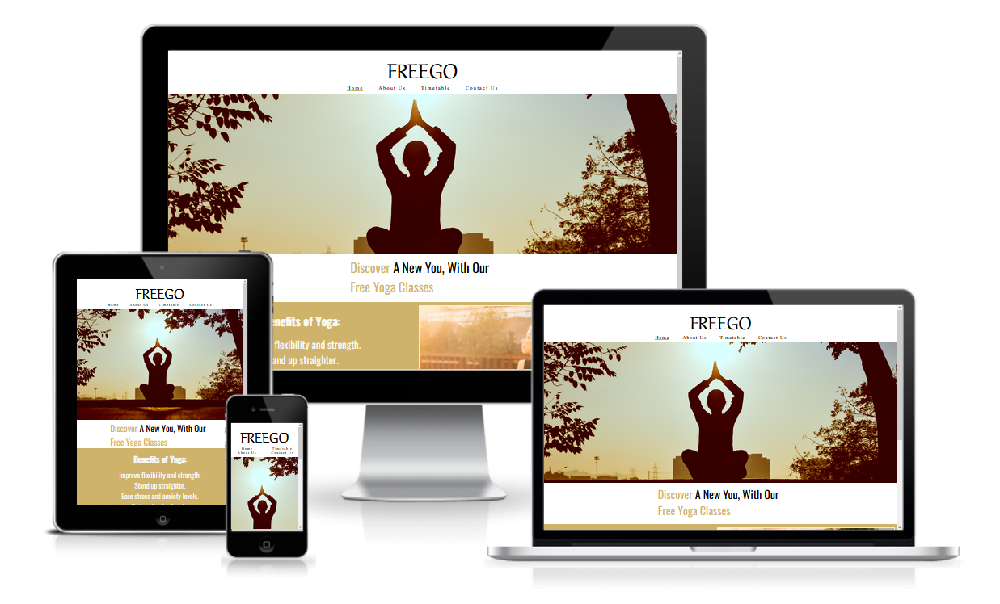
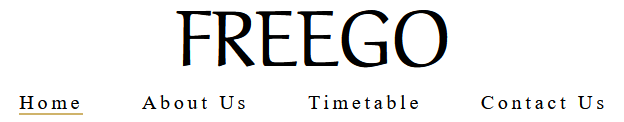
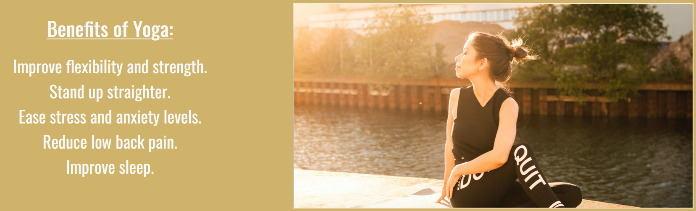
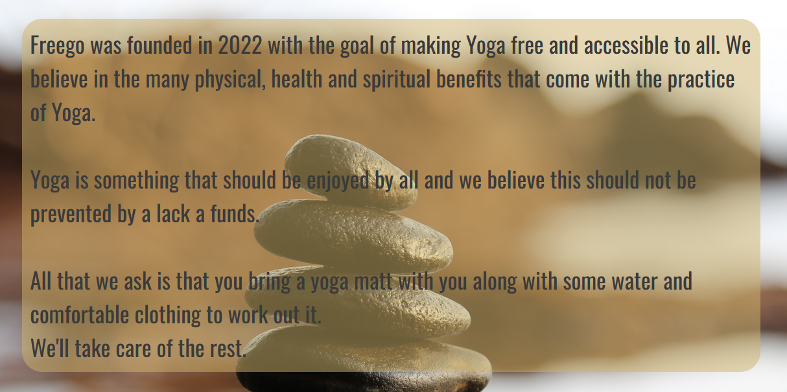
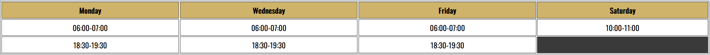
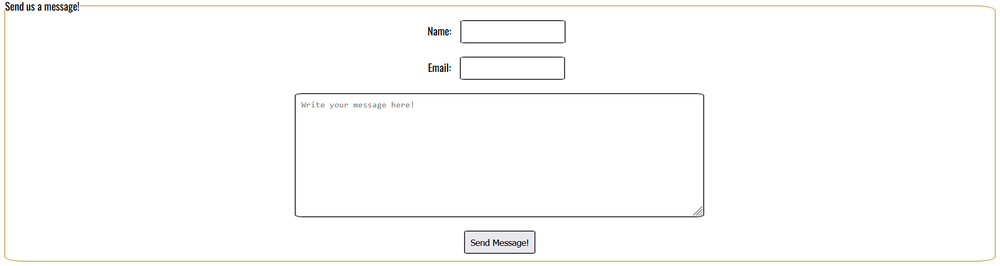

# Freego Yoga Club

 Welcome to Freego Yoga Club!
 This is a club designed to encourage all age groups to give the wondeful discipline of yoga a go. The principle of making it free to all is so that budget or cost wont be a contribuing factor in trying something new or joining a new club.

 The website is designed to be concise explain what Freego is, as well as give a way to view our class times and to also contact us so that you can find out more or ease any reservations you may have prior to joining a class.

 

 # Features

 I have a number of different features in my website that all coincede with the overarching goal of making the website easy to read, move through and find information.

 ## Clickable logo and nav bar

 - Logo
    - The logo displayed at the top of each page is clickable on all four pages. Allowing an easy way to navigate back to the home landing page
 - Nav bar
    - A responsive nav bar that is featured in the header of every page for easy navigation throughout the website.
    - An underline is displayed to show the current webpage the user is on.
    - When a nav item is hovered over the background and text change slightly to show the user that this web page can be clicked on.

## Home landing page image

 - Upong landing on the home page the user is greeted with a peaceful image of an individual practicing an inconic yoga pose infront of a beautiful sunset. This is to show the peace and beaty that comes with the practive of yoga so that the user imediately identifies what the website is about.

 

## Main text

 - Below the hero image there is a piece of text that is displayed in two different colours. The reason for this is to emphasize the purpose of the website and also what it hopes to achieve.
 - Using two different colours we are able to display not only the message "Discover a new you, with our free yoga classes" but also the message "Discover free yoga classes".

 

## Benefits of Yoga
 
 - Another image is placed the fits the theme of the website both in purpose and colours. This is an image which colours fit that of the website and depicts a woman peacefully practicining yoga beside a river.
 - A list of benefits that can be gained through the practice of yoga is displayed. This is to provide some reasons why one may wish to take up the practive of yoga.

 

## Footer

 - The footer of the website is designed to be minimalistic and include a number of links to the different social medias attached to Freego. These are displayed using icons obtained through "Font Awesome".
 - These icons are clickable and will open up the respective social medias in a new page.

 

## About us

 - The about us page includes a beautiful image of stacked rocks. Overlaying this is text with a brief overview showing the history of the website along with what it is all about.

 

## Timetable

 - A page is dedicated to the class times which is displayed in a timetable due to the use of a table. This is help the user easily navigate and view what class times are available to them.

 

## Contact us

 - A contact us page was designed as with starting a new hobby or activity their can be a lot of anxiety and reservations about showing up. This allows the user to reach out with a message through the use of a form. It is required for the user to input their name and email address before inputting their message and using the button below titled "Send Message!". This ensure we are able to receive an respond to the message the user has sent.
 - Each box when clicked will also display a different background colour to help show the user exactly where their text will display

 

# Testing

A number of different tests were conducted to ensure the website and all pages ran smoothly and correctly for any user that may be attempting to access the website.
 - Once each feature was created it was tested to ensure that it worked correctly before moving onto the next feature. This included testing the main logo header image correctly was clickable and would return to the landing page. That each button on the nav bar correctly brought the user to the correct page. Also ensuring that the correct page was displayed with a underline when active and that pages would show a different background and text colour when hovered.
 - The for was also tested by attempting to use the send message button while leaving different fields empty.
 - The flow and the layout of the website was tested once the responsiveness of the website had been worked on. This included testing how the website would be displayed on a large 25 inch monitor, down to a 13 inch laptop screen as well as different mobile screens. To ensure I could test this further I also sent my live link to a number of different friends and family members and asked them to attempt to open it on their computers and phones and send me screenshots of screenshare what they were seeing.
 - The W3C Validator was then also used to detect any bugs or errors. Initially this returned 2 bugs with an alt attribute and one with the placement of a script tag within my html. These were resolved and then W3C Validator was ran again to ensure they were fixed correctly.

 ## Validator Testing
 - HTML
    - No errors were returned when passing through the official [W3C validator](https://validator.w3.org/nu/?doc=https%3A%2F%2Fcmurphy94.github.io%2Ffreego-yoga-club%2Findex.html)
 - CSS
    - No errors were returned when passing through the official [Jigsaw validator](https://jigsaw.w3.org/css-validator/validator?uri=https%3A%2F%2Fcmurphy94.github.io%2Ffreego-yoga-club%2Findex.html&profile=css3svg&usermedium=all&warning=1&vextwarning=&lang=en)

# Credits

## Code
 - I used the website [w3schools](https://www.w3schools.com) to help resolve some things on my website. 
    - A lot of my content including my header and nav bar is center aligned. When navigating onto a page which did not have enough content to need a scroll bar it would cause the header content to slightly move to compensate for no scroll bar appearing. To resolve this I used the overflow-y scroll to implement a scroll bar on all pages. This was obtained from this [w3schools article](https://www.w3schools.com/cssref/css3_pr_overflow-y.asp).
    - To help align my about us page correctly I also learned about and used flex from this [w3schools article](https://www.w3schools.com/cssref/css3_pr_flex.asp).

## Media
 - There are three seperate images that are used through my website. I obtained all of these images from the free stock photo website known as [Pexels](https://www.pexels.com).

## Miscellaneous
 - There are two main fonts used in places through my websites that I obtained externally, These were Aref Ruqaa Ink and Oswald. These were both obtained through the [Google Fonts Website](https://fonts.google.com).
 - On the footer aspect of my website I used three images to link to different social media websites. These images that were used and inputted were obtained from [Font Awesome](https://fontawesome.com/kits).